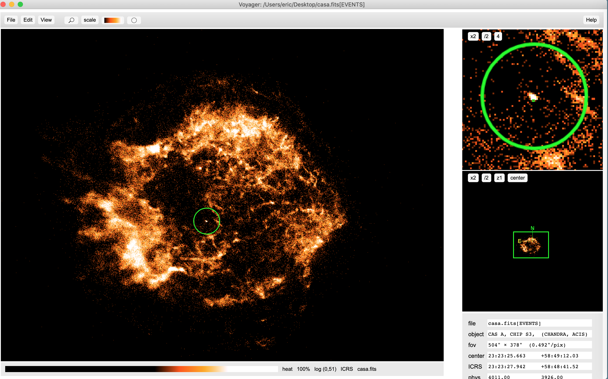

Coming soon ...
===============

Voyager: image display for Macs and Linux based on JS9
======================================================

What is it?
-----------

A self-contained Mac/Linux desktop image display application using JS9
(https://js9.si.edu) as its display engine.

How do I install it?
--------------------

Download the desktop app zip file from the main JS9 website:

https://js9.sfi.edu/downloads/Voyager-darwin-x64-3.1.0.zip

Unzip the downloaded file (if not done automatically) and move Voyager.app into
the system /Applications directory or your personal ~/Applications directory.

Using the Finder, you can drag the Voyager.app folder onto the Dock
and just click to start.

Can I use scripting with this version of JS9?
---------------------------------------------

Yes, if you install Node.js, which is available at: https://nodejs.org.

Once Voyager is running, you can save the *js9msg* script into your home
directory by selecting the *File: save messaging script* menu option.  This
script is identical to the *js9* script that comes with the full JS9 repository,
but is configured to know where you have installed the Voyager app.

The *js9msg* script allows you to control Voyager from the command line using
the JS9 Public API:

    js9msg Load chandra.fits '{"scale":"log","colormap":"red","contrast":5.78,"bias":0.15}'
    js9msg Load spitzer.fits '{"scale":"log","colormap":"blue","contrast":6.3,"bias":0.54}'
    js9msg ReprojectData chandra.fits

Can I run server-side analysis tasks?
-------------------------------------

The Analysis menu contains entries for Funtools-based tasks such as
*FITS Header(s)*, *Counts in Regions*, and *Radial Profile*, which
have already been installed in Voyager.

Can I change/configure the JS9 files that come with the app?
------------------------------------------------------------

Yes, you can! The JS9 files are contained in this folder:

    /path/to/Voyager.app/Contents/Resources/app

So, for example, you can edit the js9prefs.js file and set up
site-wide preferences. Or you can edit/replace the js9.html file that
defines the desktop's web page interface.

Where can I find out more about JS9 itself?
-------------------------------------------

Visit the main JS9 web site:

    https://js9.si.edu

or the JS9 GitHub repository:

    https://github.com/ericmandel/js9

What's the license?
-------------------

JS9 is distributed under the terms of The MIT License.

Who's responsible?
------------------

Eric Mandel, Alexey Vikhlinin

Center for Astrophysics | Harvard & Smithsonian
